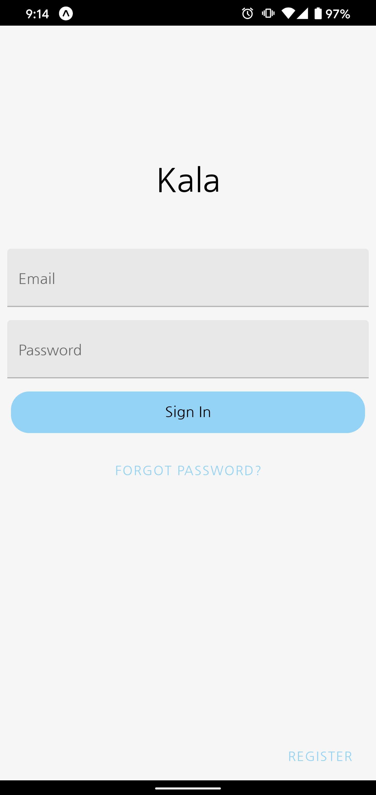
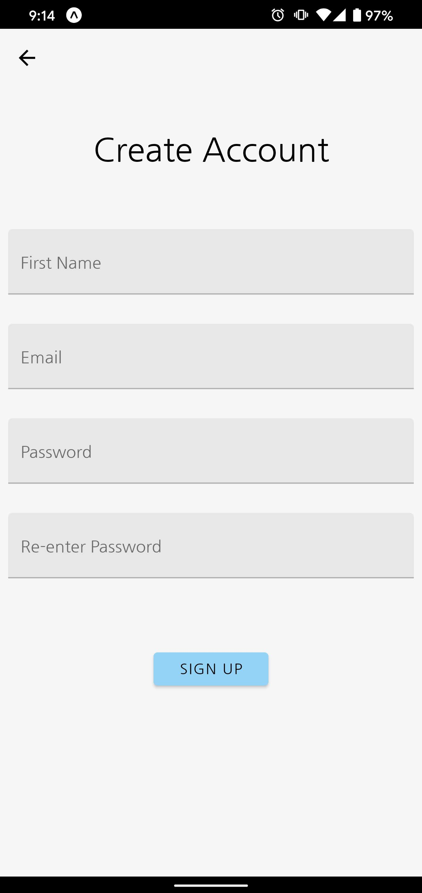
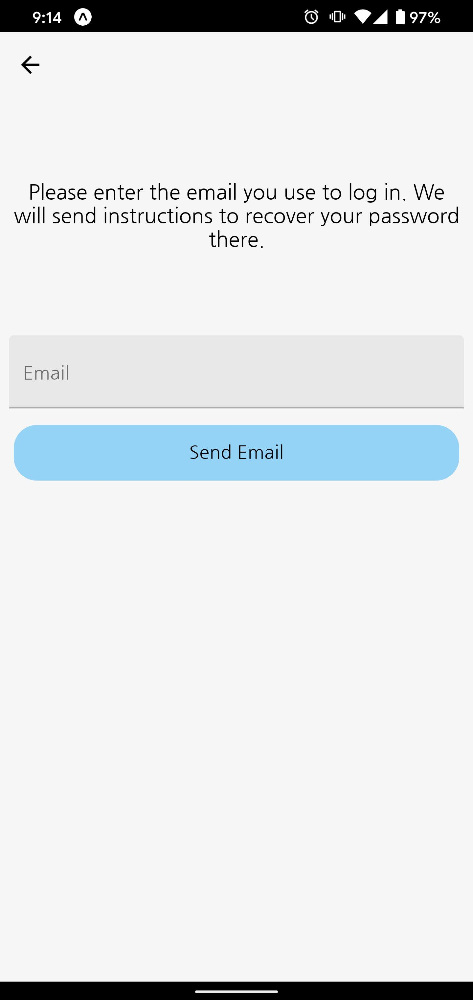
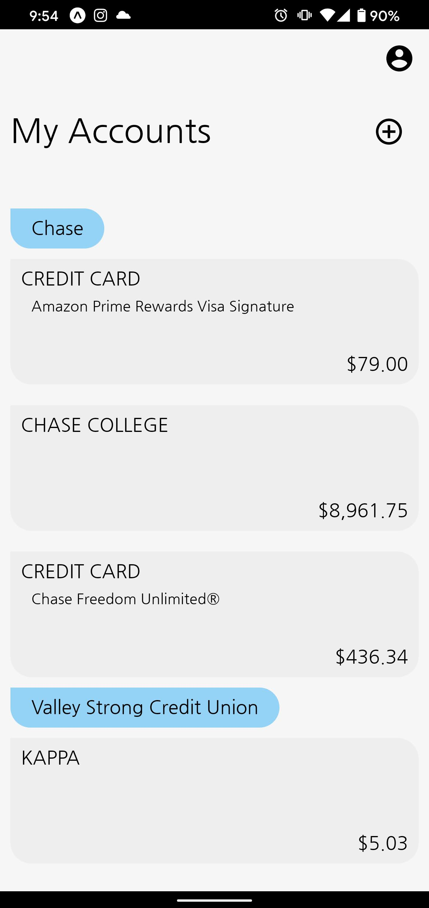
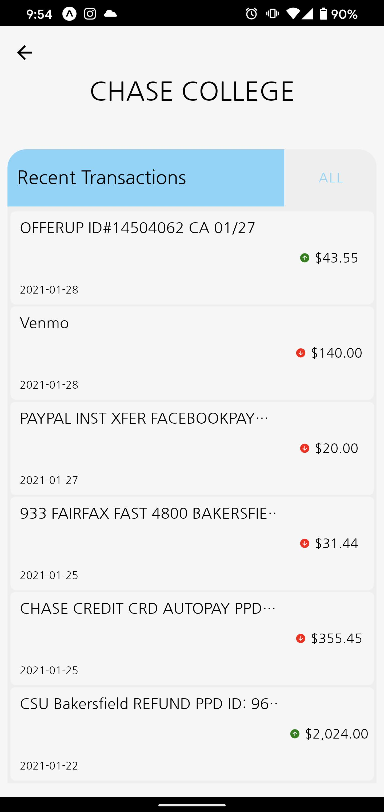
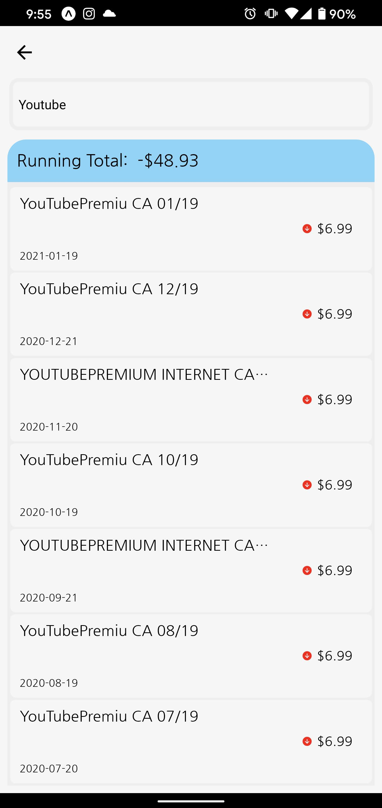
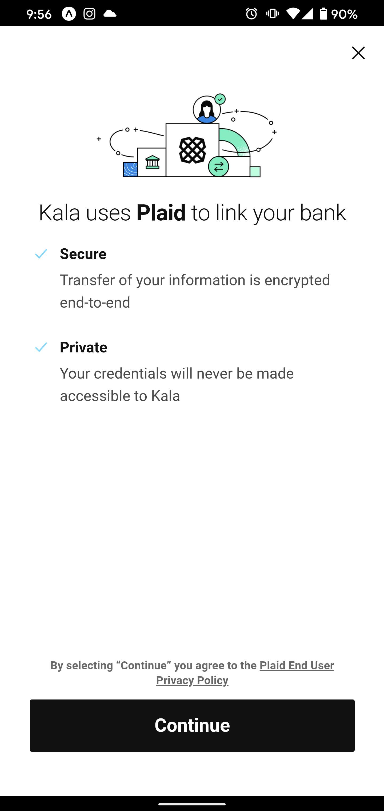

# Kala

Kala is a finance app created to see all of your banks, accounts, and transactions in one place

## In-App Screenshots

   
   
   

   
   
   

   
   

## Custom API used
**[RESTful API using ASP.NET 5](https://github.com/DylanGIV/kala-api)**

## Created Using

* [React Native](https://facebook.github.io/react-native/)
    Cross-platform app development framework
* [React Native Paper](https://reactnativepaper.com)
    UI Library
* [Plaid API](https://plaid.com)
    API used to connect users to their banks
* [Expo](https://expo.io)
    Developer tool for making universal native apps that run on multiple platforms
* [Redux](https://redux.js.org)
    State management library

## Authors

* **Genaro Dylan Gonzalez**
